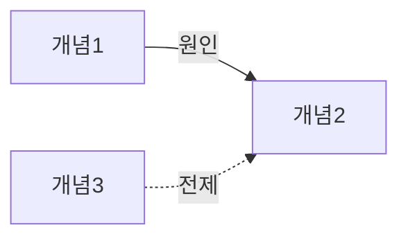

# 01_정리본 작성 가이드

**목적: 이해.** 다 읽은 학습자가 "이 강의는 무엇을 왜 말했는가"를 구조로 설명할 수 있어야 한다.

## 구성 (순서 고정)

```markdown
# 01 정리본 — {강의 제목}

> **한 줄 요약** — {강의 전체를 인과 한 문장으로: "A 때문에 B가 일어나고, 그래서 C해야 한다"}
>
> **이 강의가 답하려는 질문** — "{핵심 질문}?"

## 목차
| 구간 | 소주제 | 역할 |
|---|---|---|
| [00:00–02:15] | … | 문제 제기 |

## 큰 그림: 원인 → 과정 → 결과
(analysis 5번 사슬을 짧은 문단 또는 번호 흐름으로. 각 단계에 ts)

## 개념 카드

::: card C1. {개념명}
- **정의** — … [ts]
- **왜 필요한가** — 이 개념이 없으면 무엇을 설명할 수 없나 / 어떤 문제를 풀려고 나왔나 [ts]
- **작동 원리** — 원인 → 과정 → 결과 (화살표 사용 가능) [ts]
- **예시** — 강사의 예시 [ts]
- **흔한 오해** — ✗ … → ✓ … (강사가 지적했으면 ts, 아니면 [보충])
:::

(개념 수만큼 반복 — config 의 max_concepts 이하, 중요도 순)

## 개념 관계도



텍스트 버전(PDF에서 그림이 안 나올 때도 읽히도록 항상 함께 씀):
```
개념1 ──(원인)──▶ 개념2 ──(결과)──▶ 개념4
개념3 ··(전제)··▶ 개념2
```

## 강사가 강조한 문장
> "…" [ts] — 왜 강조했나: …

## 스스로 점검
- [ ] 한 줄 요약을 보지 않고 핵심 질문에 답할 수 있다
- [ ] 개념 관계도를 백지에 다시 그릴 수 있다
- [ ] 각 개념의 '왜 필요한가'를 내 말로 말할 수 있다
```

## 작성 요령
- "왜 필요한가"가 이 자료의 핵심이다. 정의를 반복하지 말고 **그 개념이 해결하는 문제**를 쓴다.
- 작동 원리는 문장보다 `A → B → C` 흐름으로. 각 화살표가 "왜" 성립하는지 짧게.
- mermaid 노드 이름은 짧게(10자 이내). 괄호·따옴표·콜론은 노드 라벨에 쓰지 않는다(문법 오류 원인).
- 관계 종류는 analysis 4번과 동일하게: 원인(실선), 전제(점선 `-.->`), 대비(`<-->`) 등.
- 심화 레벨: 카드마다 **경계 조건**(이 원리가 성립하지 않는 경우) 한 줄 추가. 강의에 없으면 [보충].
