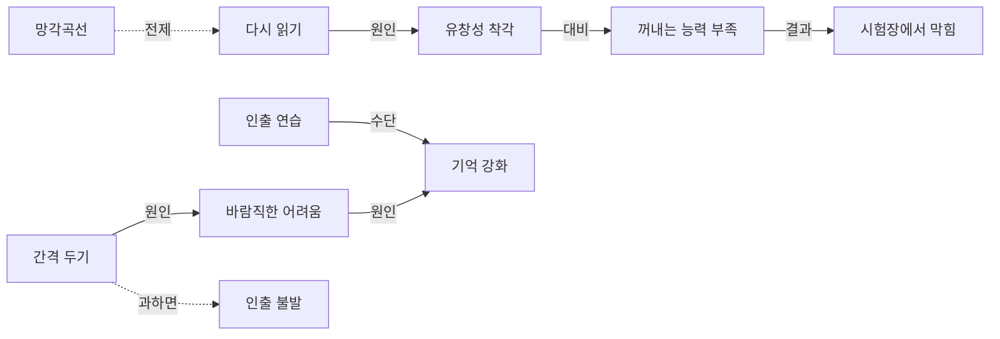

# 01 정리본 — 기억의 과학: 인출 연습

> **한 줄 요약** — 다시 읽기는 '익숙함'만 키워 안다고 착각하게 만들지만 시험은 '꺼내는 능력'을 요구하기 때문에, 스스로 꺼내 보는 인출 연습을 적당한 간격을 두고 해야 오래 기억한다.
>
> **이 강의가 답하려는 질문** — "왜 여러 번 다시 읽었는데도 시험장에서는 기억이 안 날까?" [00:10]

## 목차
| 구간 | 소주제 | 역할 |
|---|---|---|
| [00:00–00:22] | 오늘의 질문 | 문제 제기 |
| [00:22–01:01] | 에빙하우스의 망각곡선 | 전제: 망각은 자연스럽다 |
| [01:01–02:06] | 다시 읽기와 유창성 착각 | 원인 진단 |
| [02:06–03:11] | 인출 연습과 숲길 비유 | 해결책과 원리 |
| [03:11–03:56] | 4회 읽기 vs 3회 떠올리기 실험 | 근거 |
| [03:56–05:07] | 간격 두기와 바람직한 어려움 | 해결책 강화와 한계 |
| [05:07–05:53] | 정리와 숙제 | 정리 |

## 큰 그림: 원인 → 과정 → 결과

**① 문제가 생기는 구조**
다시 읽기 → 글이 눈에 익숙해짐 [01:11] → "안다"고 느낌 = 유창성 착각 [01:26] → 그러나 꺼내는 능력은 훈련되지 않음 [01:37] → 꺼내기를 요구하는 시험에서 막힘 [01:47]

**② 해결의 구조**
인출 연습 [02:06] → 꺼내려고 애씀 → 기억으로 가는 길이 튼튼해짐 [02:36] → 일주일 뒤에도 더 많이 기억 [03:35]

**③ 효과를 키우는 구조와 그 한계**
간격 두기 [04:05] → 조금 잊은 상태에서 꺼냄 → 인출이 적당히 어려워짐 [04:17] → 기억이 더 강해짐(바람직한 어려움) [04:30]
단, 간격이 너무 길면 → 전혀 못 꺼냄 → 인출이 일어나지 않음 [04:53]

## 개념 카드

::: card C1. 망각곡선
- **정의** — 새로 배운 내용이 시간이 지나면서 얼마나 빨리 잊히는지를 보여주는 그래프 [00:22]
- **왜 필요한가** — "왜 잊어버리는가"에 대한 출발점. 망각이 내 탓이 아니라 **정상적인 현상**임을 알아야 올바른 대책(더 읽기 ✗ → 꺼내기 ✓)을 세울 수 있다 [00:50]
- **작동 원리** — 배운 직후 기억이 가장 빠르게 떨어짐 → 시간이 갈수록 떨어지는 속도가 느려짐 [00:39]
- **예시** — 강의에서는 그래프 모양만 설명 (구체적 수치 없음)
- **흔한 오해** — ✗ 잊는 건 게으르기 때문 → ✓ 뇌가 원래 그렇게 작동하기 때문 [00:50]
:::

::: card C2. 다시 읽기
- **정의** — 같은 글을 여러 번 읽는 공부 방식. 강의에서 따로 정의하지 않고 "많은 학생들"의 대처법으로 소개 [01:01]
- **왜 필요한가(이 강의에서의 역할)** — 가장 흔한 공부법이 왜 기대만큼 효과가 없는지 보여 주는 **반례**
- **작동 원리** — 반복해서 읽음 → 글이 눈에 익숙해짐 [01:11] → 안다고 느낌 [01:26]
- **예시** — 실험에서 글을 네 번 읽은 집단 [03:11]
- **흔한 오해** — ✗ 잊어버리니까 더 많이 읽으면 된다 → ✓ 그게 바로 착각 [01:01–01:11]
:::

::: card C3. 유창성 착각
- **정의** — 익숙해지면 그 내용을 안다고 느끼는 것 [01:26]
- **왜 필요한가** — "공부할 땐 다 알았는데 시험장에선 막힌다"는 현상의 **원인**을 설명한다 [01:47]
- **작동 원리** — 익숙함(느낌) ↑ → "안다"는 확신 ↑ → 그러나 실제로 꺼낼 수 있는지는 확인되지 않음 → 시험에서 드러남
- **예시** — 실험에서 공부 직후엔 네 번 읽은 집단이 더 잘 기억한다고 **느꼈음** [03:27]
- **흔한 오해** — ✗ 안다고 느끼면 아는 것이다 → ✓ 공부할 때의 느낌과 실제 기억은 다를 수 있다 [03:45]
:::

::: card C4. 알아보는 능력 vs 꺼내는 능력
- **정의** — 익숙하다는 느낌(알아보기)과 스스로 꺼낼 수 있다는 것은 **전혀 다른 능력** [01:37]. [보충] 심리학에서는 각각 재인(recognition)과 회상(recall)이라 부른다.
- **왜 필요한가** — 다시 읽기가 왜 시험에서 통하지 않는지를 가르는 **기준**. 시험은 알아보는 능력이 아니라 꺼내는 능력을 요구한다 [01:47]
- **작동 원리** — 다시 읽기는 '알아보기'만 연습시킴 → 시험이 요구하는 '꺼내기'와 어긋남 → 막힘
- **예시** — 다시 읽기만 한 학생: 공부할 땐 다 안다고 느끼는데 시험장에선 막힘 [01:47]
- **흔한 오해** — [보충] ✗ 책을 보면 다 아는 내용이니 준비됐다 → ✓ 책을 **덮고** 꺼낼 수 있어야 준비된 것
:::

::: card C5. 인출 연습
- **정의** — 책을 덮고 배운 내용을 기억에서 스스로 꺼내 보는 공부법 [02:06]
- **왜 필요한가** — 시험이 요구하는 '꺼내는 능력'을 직접 훈련하는 유일한 방법이기 때문 [01:47], [02:06]
- **작동 원리** — 꺼내려고 애씀 → 그 과정 자체가 기억으로 가는 길을 더 튼튼하게 만듦 [02:36]
- **예시** — 백지에 써 보기, 스스로 문제 풀기, 친구에게 설명하기 [02:25] / 숲길 비유: 여러 번 걸어 다닌 길은 뚜렷해짐 [02:45], 읽기는 남이 낸 길 구경·인출은 내 발로 걷기 [03:01] / 실험: 한 번 읽고 세 번 떠올린 집단이 일주일 뒤 훨씬 더 많이 기억 [03:11–03:35]
- **흔한 오해** — [보충] ✗ 인출 연습 = 문제집 풀기뿐 → ✓ 백지 쓰기·설명하기도 모두 인출 [02:25]
:::

::: card C6. 간격 두기
- **정의** — 같은 내용을 한 번에 몰아서 하지 않고 시간 간격을 두고 나눠서 복습하는 것 [04:05]
- **왜 필요한가** — 인출 연습의 효과를 **더 크게** 만든다 [03:56]
- **작동 원리** — 간격을 둠 → 조금 잊어버린 상태 → 꺼내기가 더 어려워짐 [04:17] → 적당히 어려운 인출 → 기억이 더 강해짐 [04:30]
- **예시** — 강의에서 구체적인 간격(며칠)은 제시하지 않음. [보충] 강의 논리상 기준은 "조금 잊었지만 아직 꺼낼 수 있는 때"
- **흔한 오해** — ✗ 간격은 길수록 좋다 → ✓ 너무 많이 잊으면 인출 자체가 일어나지 않으므로 너무 길어도 안 된다 [04:53]
:::

::: card C7. 바람직한 어려움
- **정의** — 적당히 어려운 인출이 기억을 더 강하게 만드는 것 [04:30]
- **왜 필요한가** — "쉽게 술술 되는 공부가 좋은 공부"라는 직관을 뒤집어, 간격 두기가 **왜** 효과적인지 설명한다 [04:17]
- **작동 원리** — 꺼내기 어려움(적당히) → 더 애써서 꺼냄 → 기억 강화. 어려움이 지나치면 → 꺼내지 못함 → 효과 없음 [04:53]
- **예시** — 간격을 두고 조금 잊은 상태에서 꺼내기 [04:17]
- **흔한 오해** — ✗ 어렵기만 하면 다 좋다 → ✓ '적당히' 어려워야 한다 [04:43]
:::

## 개념 관계도



텍스트 버전:
```
망각곡선 ··(전제)··▶ 다시 읽기 ──(원인)──▶ 유창성 착각 ──▶ 꺼내는 능력 부족 ──(결과)──▶ 시험장에서 막힘

인출 연습 ─────────────────────(수단)──────────────────────▶ 기억 강화
간격 두기 ──(원인)──▶ 바람직한 어려움 ──(원인)──▶ 기억 강화
   └··(간격이 너무 길면)··▶ 인출 불발
```

## 강사가 강조한 문장
> "그런데 이게 바로 착각입니다. 이 부분 정말 중요해요." [01:11]
> — 왜 강조했나: 학생들의 가장 흔한 대처(더 읽기)를 정면으로 뒤집는 지점이라서.

> "익숙하다는 느낌과 스스로 꺼낼 수 있다는 것은 전혀 다른 능력입니다." [01:37]
> — 왜 강조했나: 강의 전체 논리의 경첩. 이 구별이 있어야 인출 연습이 왜 필요한지 설명된다.

> "꺼내려고 애쓰는 과정 자체가 기억으로 가는 길을 더 튼튼하게 만듭니다." [02:36]
> — 왜 강조했나: 인출 연습의 작동 원리. 곧바로 숲길 비유로 재설명했다.

> "공부할 때의 느낌과 실제 기억은 다를 수 있다는 겁니다." [03:45]
> — 왜 강조했나: 실험 결과의 결론이자 유창성 착각의 증거.

> "어렵기만 하면 다 좋은 건 아닙니다." [04:43]
> — 왜 강조했나: '바람직한 어려움'을 과하게 적용하는 오해를 막기 위해.

## 스스로 점검
- [ ] 한 줄 요약을 보지 않고 "왜 다시 읽어도 시험장에서 기억이 안 나는가"에 답할 수 있다
- [ ] 개념 관계도를 백지에 다시 그릴 수 있다
- [ ] '유창성 착각'과 '바람직한 어려움'이 각각 무엇의 원인인지 말할 수 있다
- [ ] 간격이 "왜" 효과가 있고 "언제" 효과가 없는지 둘 다 말할 수 있다
